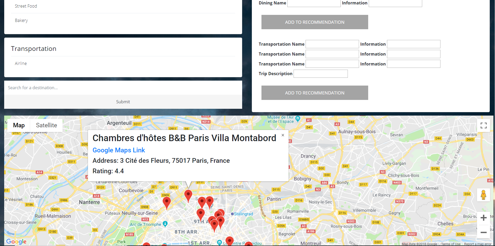

# Tripify

Tripify is a travel planning app where users can connect with travel consultants and get easily accessible, professional help in planning trips and vacations.

## Utilized Technologies

-Java 
-MySQL/MariaDB 
-SQL Power Architect 
-Play Framework 
-Google Maps API 
-Google Places API 
-HTML 
-CSS 
-JavaScript

## User Profile Example

## Add Trip Example

## Create Recommendations Example (Consultant View)

